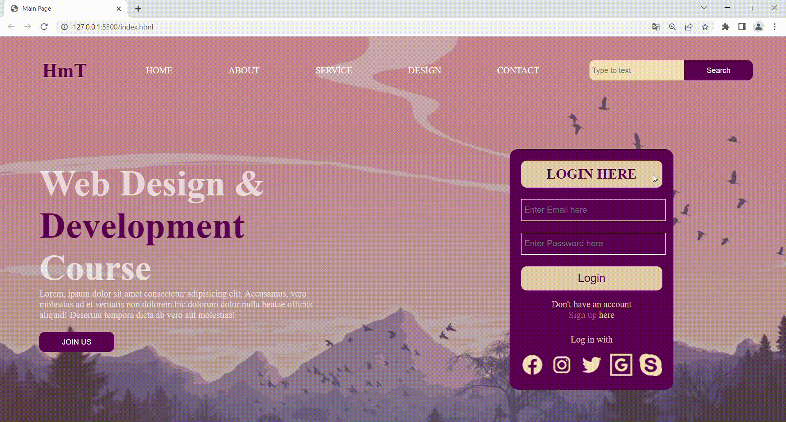

# html7

<h1> Bir Web Sitesi Çalışması</h1>

<h1>Siteye <a href="https://hamits.github.io/html7/">burdan</a> ulaşabilirsiniz</h1>

<h1>Bu projede sadece HTML ve CSS kullanılmıştır...</h1>
<h1>Bu projenin SCSS kullanılarak düzenlenen versiyonuna <a href="https://github.com/hamits/html7-scss">burdan</a> ulaşabilirsiniz</h1>

<h2>Ekran Görüntüsü</h2>

